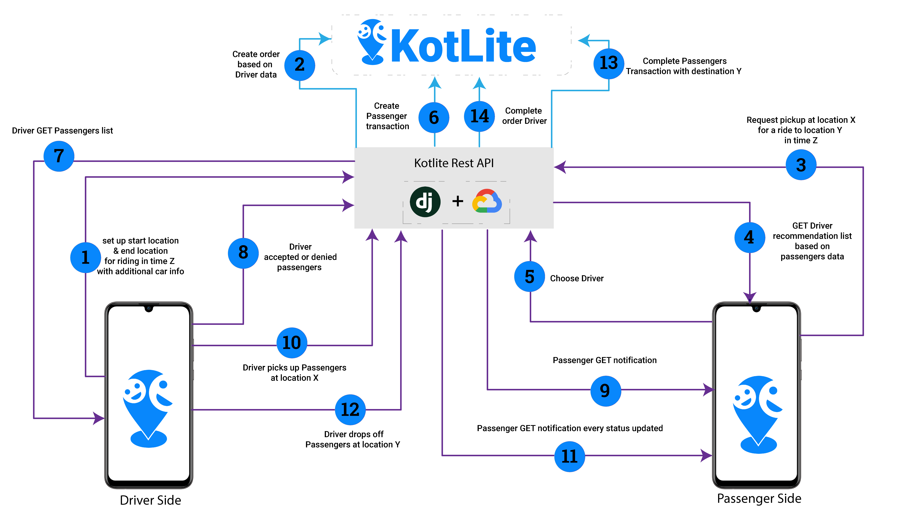
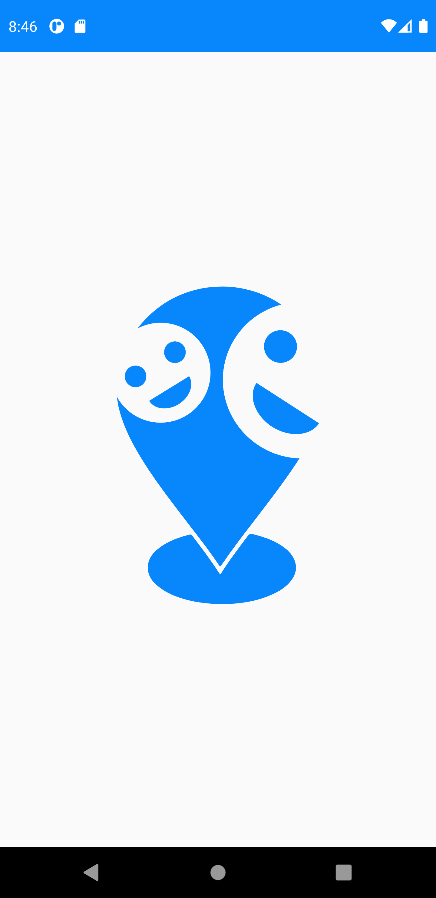
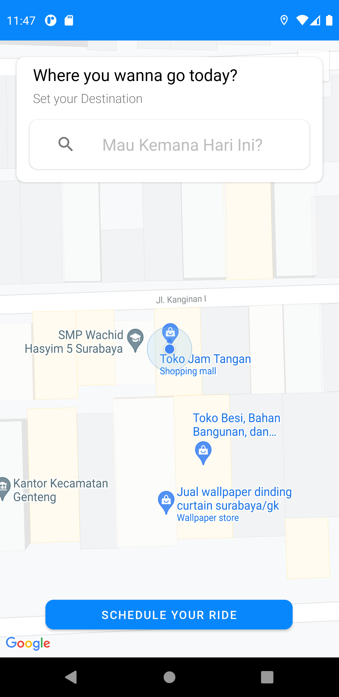
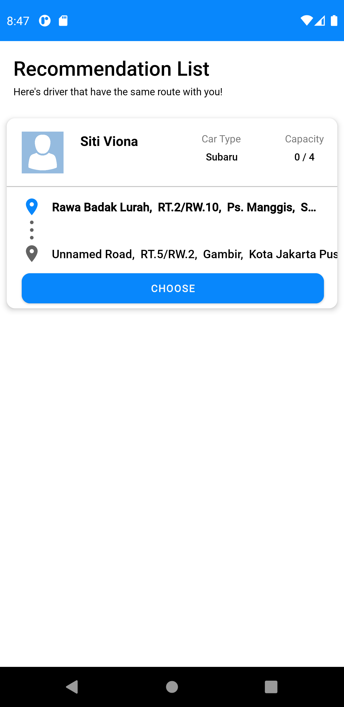

 

  
   
  

  

    
    
  

  <h1 align="center">Kotlite (Angkot Elite) Project</h1>

  

    An Indonesian Ridesharing Application
    <!--   -->
    <!-- <a href="https://github.com/github_username/repo_name"><strong>Explore the Projects »</strong></a> -->
     
     
    <strong>Our Project List</strong>
     
    <a href="https://github.com/kroniz-utab/kotlite_algorithm" target="_blank">
        </img>
    </a>
    <a href="https://github.com/bismastr/kotliteApp" target="_blank">
        </img>
    </a>
    <a href="https://github.com/vionaaindah/kotliteProjectAPI" target="_blank">
        </img>
    </a>
    <a href="https://storage.googleapis.com/proud-lamp-312513/Kotlite.apk" target="_blank">
        </img>
    </a>
  

<!-- TABLE OF CONTENTS -->

  
<h2 style="display: inline-block">Table of Contents</h2>

  <ol>
    <li>
      <a href="#about-the-project">About The Project</a>
    </li>
    <li><a href="#team-members">Team Members</a></li>
    <li><a href="#our-projects-repository">Our Projects Repository</a></li>
    <li><a href="#our-products">Our Products</a>
    <ul>
      <li><a href="#prerequisites">Prerequisites</a></li>
      <li><a href="#android-apps">Android Apps</a></li>
      <li><a href="#api-documentations">API Documentations</a></li>
    </ul>
    </li>
    <li><a href="#acknowledgements">Acknowledgements</a></li>
  </ol>

## About The Project

Indonesia’s major cities are suffering chronic congestion due to the growing number of vehicles in the country every year. Jakarta is one of the top 10 most congested in the world. Various solutions were proposed by the government as traffic congestion become one of the root issues accelerating air-pollution problem, CO2 emissions, delays, a higher chance of collisions, and the inability to forecast travel time accurately. The statistic shows the big reason society uses their vehicles is because of the mindset that they’ll reduce the travel time, but the reality proves how it turns out to be the opposite.

Kotlite is here as a breakthrough idea that answers the need of users to find drivers or passengers from and going to the same routes. It is designed to optimistically accelerate the transformation of the citizens' lifestyle to rideshare and network, eliminating incurable rush hour traffic and provide practicality for user's mobility from one place to another.

## Team Members

|         Member         | Student ID |        Path        |                Project Role                |                                                  Contacts                                                  |
| :--------------------: | :--------: | :----------------: | :----------------------------------------: | :--------------------------------------------------------------------------------------------------------: |
|   Dzakiyyah Rosyadi    |  M0060566  |  Machine Learning  | Project Manager, Machine Learning Engineer |     [![kia-linkedin][linkedin-shield]][kia-linkedin-url][![kia-github][github-shield]][kia-github-url]     |
|   Ade Hermawan Fajri   |  M1471710  |  Machine Learning  |         Machine Learning Engineer          |     [![ade-linkedin][linkedin-shield]][ade-linkedin-url][![ade-github][github-shield]][ade-github-url]     |
|  Bisma Satria Nugraha  |  A0040278  | Mobile Development |              Mobile Developer              | [![bisma-linkedin][linkedin-shield]][bisma-linkedin-url][![bisma-github][github-shield]][bisma-github-url] |
|     Ferry Pratama      |  C2472340  |  Cloud Computing   |                   DevOps                   | [![ferry-linkedin][linkedin-shield]][ferry-linkedin-url][![ferry-github][github-shield]][ferry-github-url] |
| Siti Viona Indah Swari |  C2472348  |  Cloud Computing   |                   DevOps                   |     [![vio-linkedin][linkedin-shield]][vio-linkedin-url][![vio-github][github-shield]][vio-github-url]     |

<!-- |   Hamonangan Sitorus   |  A1141446  | Mobile Development |              Mobile Developer              | [![monang-linkedin][linkedin-shield]][monang-linkedin-url][![monang-github][github-shield]][monang-github-url] | -->

## Our Projects Repository

- [Kotlite Android Apps](https://github.com/bismastr/kotliteApp)
- [Kotlite RestAPI](https://github.com/vionaaindah/kotliteProjectAPI)
- [Kotlite Matching Recommendations Algorithm](https://github.com/kroniz-utab/kotlite_algorithm)

## Our Products

- [Android Apps Installer .apk](https://storage.googleapis.com/proud-lamp-312513/Kotlite.apk) (8.1 Mb)

### Prerequisites

- Android 5.0 Lolipop
- Internet Connection
- Location Services

### Android Apps

  </img>&nbsp; &nbsp;&nbsp; &nbsp;

### API Documentations

Our Rest API is the way for computer systems to communicate over HTTP in a similar way to web browsers and servers. We share databases between systems to enable our application, working effectively for our users.

_For more usage, please refer to the [**Documentation**](http://kotlite.xyz/docs/)._

## Features of This Projects

1. Driver Features

   - Doing travel scheduling
   - View the list of passengers who made a booking
   - View passenger details
   - Knowing the direction of each passenger who makes a booking
   - Invoice

2. Passenger Feature
   - Get recommendations for drivers who have similar trips
   - Doing travel scheduling
   - Driver status notification
   - Invoice

## Acknowledgements

  </img>&nbsp; &nbsp;

<!-- MARKDOWN LINKS & IMAGES -->
<!-- https://www.markdownguide.org/basic-syntax/#reference-style-links -->
<!-- LinkedIn Link -->

[linkedin-shield]: https://img.shields.io/badge/LinkedIn--blue?style=social&logo=Linkedin
[kia-linkedin-url]: https://www.linkedin.com/in/dzakiyyah-rosyadi/
[ade-linkedin-url]: https://www.linkedin.com/in/ade-fajri/
[bisma-linkedin-url]: https://www.linkedin.com/in/bisma-satria-0123b3187/
[monang-linkedin-url]: https://www.linkedin.com/in/hamonangan-sitorus-644986166/
[vio-linkedin-url]: https://www.linkedin.com/in/sitivionaindahswari/
[ferry-linkedin-url]: https://www.linkedin.com/in/ferry-pratama/

<!-- Github Link -->

[github-shield]: https://img.shields.io/badge/GitHub--blue?style=social&logo=Github
[kia-github-url]: https://github.com/dzaarsyd
[ade-github-url]: https://github.com/kroniz-utab
[bisma-github-url]: https://github.com/bismastr
[monang-github-url]: https://github.com/mosirus
[vio-github-url]: https://github.com/vionaaindah
[ferry-github-url]: https://github.com/ftama0
