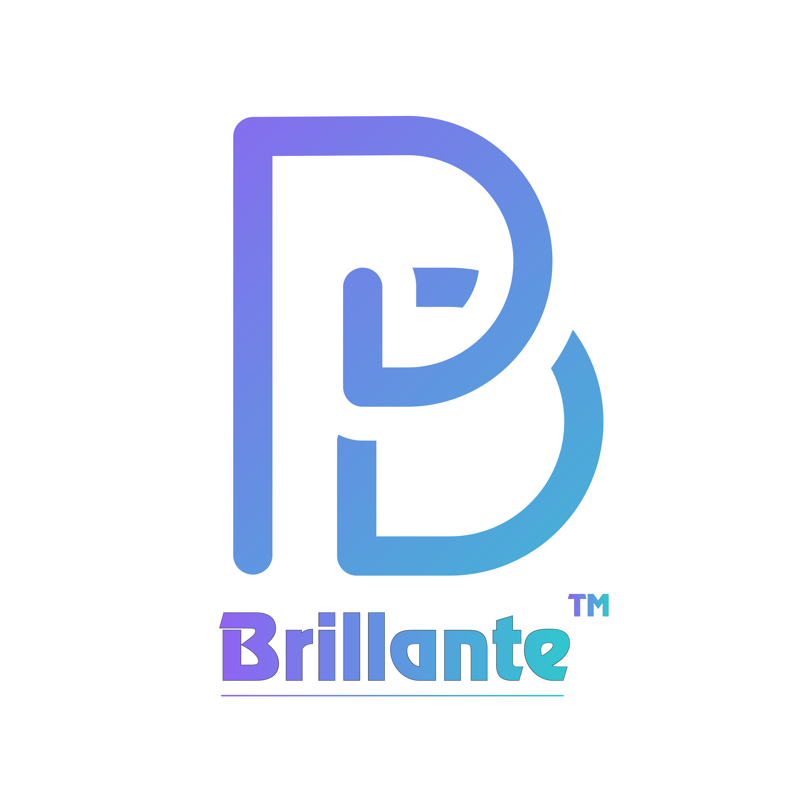
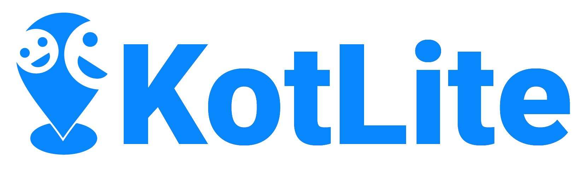

 

  
   
  

  

    
    
  

  <h1 align="center">Kotlite (Angkot Elite) Project</h1>

  

    An Indonesian Ridesharing Application
    <!--   -->
    <!-- <a href="https://github.com/github_username/repo_name"><strong>Explore the Projects »</strong></a> -->
     
     
    <strong>Our Project List</strong>
     
    <a href="https://github.com/kroniz-utab/kotlite_algorithm">
        </img>
    </a>
    <a href="https://github.com/bismastr/kotliteApp">
        </img>
    </a>
    <a href="https://github.com/SVeeIS/kotliteProjectAPI">
        </img>
    </a>
  

<!-- TABLE OF CONTENTS -->

  
<h2 style="display: inline-block">Table of Contents</h2>

  <ol>
    <li>
      <a href="#about-the-project">About The Project</a>
    </li>
    <li><a href="#team-members">Team Members</a></li>
    <li><a href="#our-products">Our Products</a></li>
    <li><a href="#contributing">Contributing</a></li>
    <li><a href="#license">License</a></li>
    <li><a href="#acknowledgements">Acknowledgements</a></li>
  </ol>

## About The Project

`jelasin secara umum (bener2 umum) nanti dijelasin juga alasan kenapa mengerjakan project ini dan latar belakangnya`

## Team Members

|         Member         | Student ID |        Path        |                Project Role                |                                                    Contacts                                                    |
| :--------------------: | :--------: | :----------------: | :----------------------------------------: | :------------------------------------------------------------------------------------------------------------: |
|   Dzakiyyah Rosyadi    |  M0060566  |  Machine Learning  | Project Manager, Machine Learning Engineer |       [![kia-linkedin][linkedin-shield]][kia-linkedin-url][![kia-github][github-shield]][kia-github-url]       |
|   Ade Hermawan Fajri   |  M1471710  |  Machine Learning  |         Machine Learning Engineer          |       [![ade-linkedin][linkedin-shield]][ade-linkedin-url][![ade-github][github-shield]][ade-github-url]       |
|  Bisma Satria Nugraha  |  A0040278  | Mobile Development |              Mobile Developer              |   [![bisma-linkedin][linkedin-shield]][bisma-linkedin-url][![bisma-github][github-shield]][bisma-github-url]   |
|   Hamonangan Sitorus   |  A1141446  | Mobile Development |              Mobile Developer              | [![monang-linkedin][linkedin-shield]][monang-linkedin-url][![monang-github][github-shield]][monang-github-url] |
|     Ferry Pratama      |  C2472340  |  Cloud Computing   |                   DevOps                   |   [![ferry-linkedin][linkedin-shield]][ferry-linkedin-url][![ferry-github][github-shield]][ferry-github-url]   |
| Siti Viona Indah Swari |  C2472348  |  Cloud Computing   |                   DevOps                   |       [![vio-linkedin][linkedin-shield]][vio-linkedin-url][![vio-github][github-shield]][vio-github-url]       |

## Our Projects Repository

- Android Apps
- RestAPI
- Algorithm

## Our Products

- Android Apps Installer .apk (xx Mb)

## Prerequisites

- Android SDK xx (Oreo)
- Internet Connection
- Location Services

## Android Apps Screenshot

_Coming Very Soon_

## API Documentation

_Coming Very Soon_

## Feature of This Projects

_Featurenya dong_

- contoh feature 1
- contoh feature 2
  - contoh subfeature 2
- contoh feature 3

<!-- MARKDOWN LINKS & IMAGES -->
<!-- https://www.markdownguide.org/basic-syntax/#reference-style-links -->
<!-- LinkedIn Link -->

[linkedin-shield]: https://img.shields.io/badge/LinkedIn--blue?style=social&logo=Linkedin
[kia-linkedin-url]: https://www.linkedin.com/in/dzakiyyah-rosyadi/
[ade-linkedin-url]: https://www.linkedin.com/in/ade-fajri/
[bisma-linkedin-url]: https://www.linkedin.com/in/bisma-satria-0123b3187/
[monang-linkedin-url]: https://www.linkedin.com/in/hamonangan-sitorus-644986166/
[vio-linkedin-url]: https://www.linkedin.com/in/sitivionaindahswari/
[ferry-linkedin-url]: https://www.linkedin.com/in/ferry-pratama/

<!-- Github Link -->

[github-shield]: https://img.shields.io/badge/GitHub--blue?style=social&logo=Github
[kia-github-url]: https://github.com/dzaarsyd
[ade-github-url]: https://github.com/kroniz-utab
[bisma-github-url]: https://github.com/bismastr
[monang-github-url]: https://github.com/mosirus
[vio-github-url]: https://github.com/SVeeIS
[ferry-github-url]: https://github.com/ftama0
